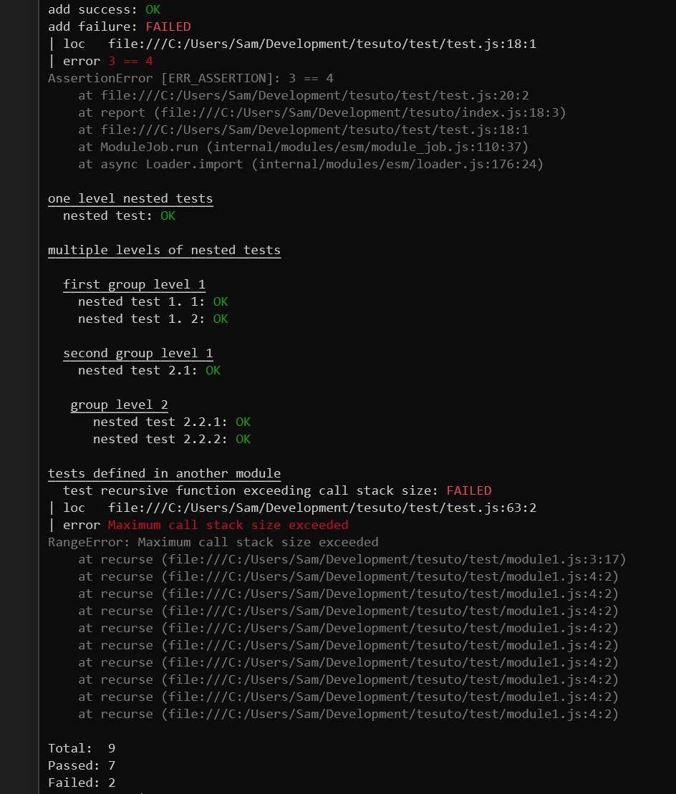

[](https://travis-ci.org/dgellow/tesuto) [](https://badge.fury.io/js/tesuto)


# tesuto

A really tiny test reporting library with [one unique dependency](https://github.com/dgellow/neocolor/).



## Usage

```typescript
import assert from "assert"
import {testing, report, result} from "tesuto"

function add (x, y) {
  return x + y;
}

// Report a test
report("add numbers", function () {
  assert.equal(add(1, 2), 3);
  assert.equal(add(2, 2), 4);
});

// Define a group of tests
testing("add function", function () {
  report("when first arg is a string, concatenate", function () {
    assert.equal(add("hello_", "you"), "hello_you");
    assert.equal(add("hello_", 2), "hello_2");
  });

  // Groups can be nested
  testing("with numbers", function() {
    report("should be associative", function () {
      assert.equal(add(1, 2), 3);
      assert.equal(add(2, 1), 3);
    });

    report("should support negative numbers", function () {
      assert.equal(add(-1, -2), -3);
      assert.equal(add(1, -2), -1);
    });
  });
});

result();
```

## API
### `report`, define a test

```typescript
report("add numbers", function () {
  assert.equal(add(1, 2), 3);
  assert.equal(add(2, 2), 4);
});
```

### `testing`, define a group of tests

> Note: Groups can be nested

```typescript
testing("add function", function () {
  report("when first arg is a string, concatenate", function () {
    assert.equal(add("hello_", "you"), "hello_you");
    assert.equal(add("hello_", 2), "hello_2");
  });
});
```

### `result`, print statistics

```typescript
result();
```
